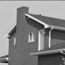
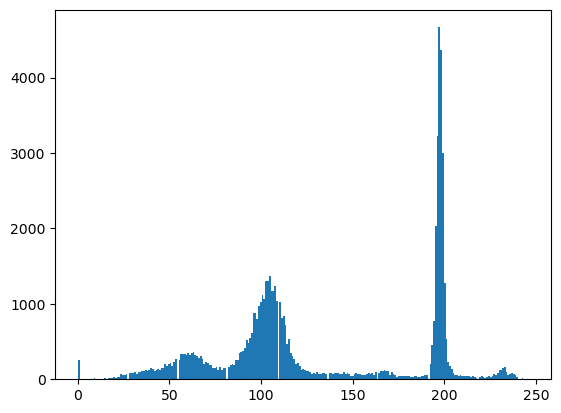
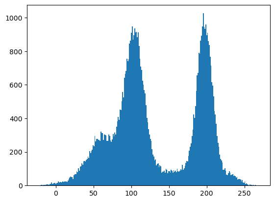
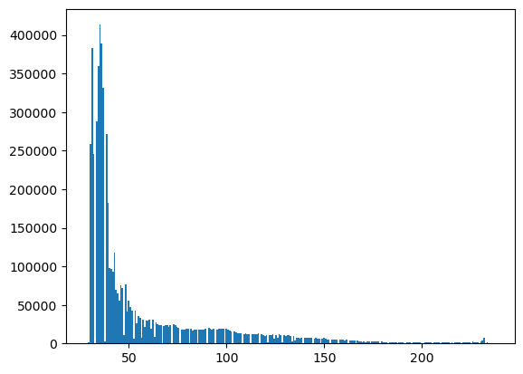
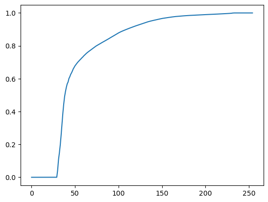
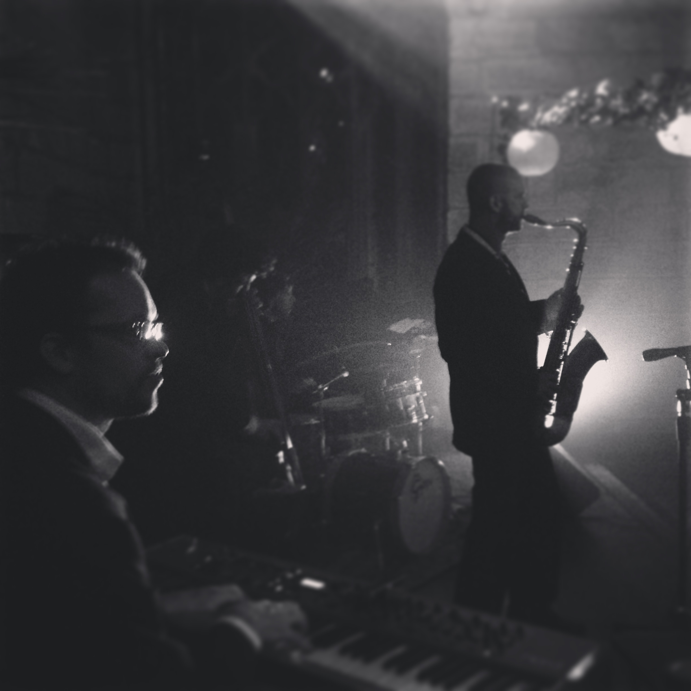
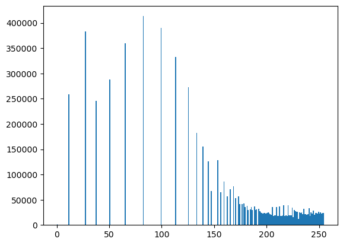
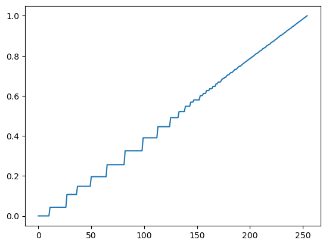
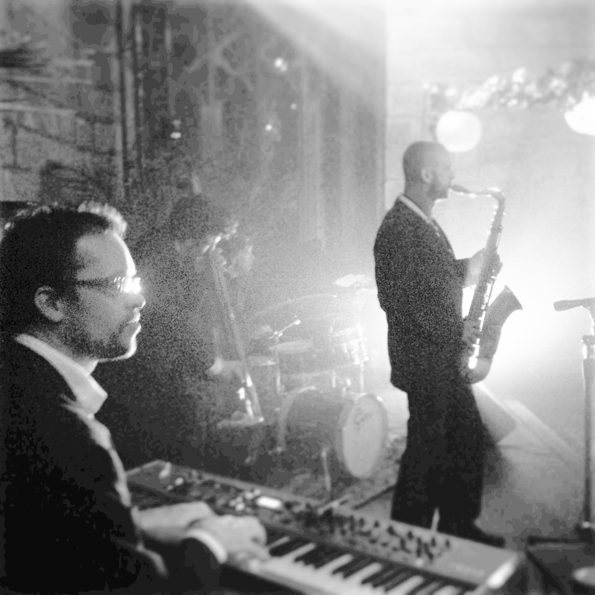
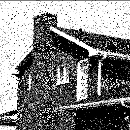

# TP1 - Questions (William Liaw)

<!-- arthur.leclaire@telecom.fr -->
<!-- gwilherm.lesne@telecom.fr -->

## 2. Visualisation et utilisation gimp

### 2.1. Zooms

<!-- |                `maison.tif`                |                `maison_petit.tif`                |
| :----------------------------------------: | :----------------------------------------------: |
|  |  | -->

- Que fait gimp pour afficher l'image en plus grand?
  - Pour afficher l'image en plus grand, GIMP réplique les pixels, dans le zoom 100%, 1 pixel de l'image correspond à 1 pixel de l'écran, dans le zoom 200% on a 4 pixels de l'écran pour chaque pixel de l'image.
- Quelle hypothèse pouvez-vous faire sur la génération de `maison_petit.tif`?
  - En appliquant le procédure décrit sur l'image `maison.tif` et comparant avec l'image `maison-petit.tif`, on voit des bandes sur l'image `maison.tif`, ce qui est résultat du repliement de spectre ou aliasing car la réduction du taille d'une image sans utilisé un méthode d'interpolation correspond a une sous-échantillonnage de l'image. Par contre, on n'observe pas de aliasing dans l'image `maison-petit.tif`, ce qui suggère que les hautes fréquence de le spectre de l'image étions mise à zéro (filtre passe bas) avant de sous-échantillonner.

### 2.2. Espace couleurs

- Comprenez-vous pourquoi les deux positions extrêmes de ce boutons font, en fait, la même transformation?
  - Les deux positions extrêmes de le bouton hue font la même transformation parce que l'espace de couleur HSV utilise un système de coordonnées cylindriques dans lequel le hue correspond aux azimut, donc les deux positions extrêmes (−180◦ et +180◦) corresponds aux même point.
- A quoi correspond la saturation (essayez -100% et +100%)?
  - La saturation correspond au dégrée de coloration du pixel, le plus bas la saturation, le plus le pixel s'approche du gris.

## 3. Niveau de gris, histogrammes et statistiques

### 3.1. Histogramme

<!-- 1. Histogramme d'image sans bruit 
   
2. Histogramme d'image avec bruit 
   
3. Image sans bruit 
   
4. Image avec bruit 
    -->

- En considérant les niveaux de gris d'une image comme la réalisation d'une variable aléatoire dont la loi est l'histogramme de l'image, interprétez le résultat.
  - En considérant les niveaux de gris d'une image comme la réalisation d'une variable aléatoire $X$ dont la loi $P_X$ est l'histogramme de l'image, quand on ajoute un bruit gaussien (variable aléatoire $Y$ dont la loi $P_Y$ est gaussien), la distribution de la variable aléatoire résultant $X+Y$ sera la convolution $P_X * P_Y$. De cette façon, le histogramme déviant plus lisse.

### 3.2. Changement de contraste

- L'aspect global de l'image est-il modifié par l'application de fonctions croissantes? Que se passe-t-il si l'on applique une transformation non-croissante des niveaux de gris?
  - L'aspect global de l'image n'est pas changé par l'application de fonctions croissants, contrairement a l'application de fonctions décroissants. Ça ce passe parce que nous sommes sensibles aux contrastes locaux, bien plus qu'aux contrastes globaux, pour ça la perception du contenu d'une image ne change pas si l'on applique une fonction croissante puisque le signal du gradient ne change pas.

### 3.3. Égalisation d'histogramme

  <!-- 1. Histogramme 
     
  2. Histogramme cumulé 
     
  3. Image 
     
  4. Histogramme avec égalisation 
     
  5. Histogramme cumulé avec égalisation 
     
  6. Image avec égalisation 
      -->

- Qu'observez-vous sur *imequal*, sur son histogramme et sur son histogramme cumulé?
  - Après réaliser l'égalisation d'histogramme, on voit plus de détail dans les régions de l'image avec les couleurs plus fréquent, dans le cas de l'image sombre.jpg, on voit plus de détail dans les régions originalement sombre, par contre, les régions plus claire, comme la texture du mur au fond, deviennent moins détailles. Aussi, l'histogramme cumulée se rapproche de l'identité et dans l'histogramme, par rapport au histogramme de l'image originale, on observe que les barres sont décalées de manière a devenir à peut près constant, si on considère les moyennes ou la densité.

### 3.4. Prescription d'histogramme

<!-- 1. Différence absolue 
   
2. Différence absolue après avoir donné à l'une des images l'histogramme de l'autre 
   
3. Image après avoir reçu un histogramme constante 
    -->

- Visualisez la valeur absolue de la différence des images, qu'observe-t-on. Même question après avoir donné à l'une des images l'histogramme de l'autre.
  - En visualisant la valeur absolue de la différence des images, on voit presque tout les objets de l'image, donc si l'objective est, par exemple, de visualiser différences liées au mouvement, cette méthode ne sera pas effective. Par contre, après avoir donné a l'une des images l'histogramme de l'autre, on observe moins de différences entre elles.
- Sachant que ces images ont été obtenues à partir d'images RAW (donc avec une réponse proportionnelle à la quantité de photons mesurée), a-t-on un moyen plus simple d'obtenir le même résultat (donner le même histogramme aux deux images)?
  - Comme la réponse est proportionnelle à la quantité de photons mesurée, si l'on prolonge le temps de exposition pour les photos prises lorsque l'ambiance était plus sombre (et, à l'inverse, si l'on réduit le temps de pose pour les photos prises lorsque l'ambiance était plus claire), on peut rapprocher les histogrammes des deux images.

### 3.5. Dithering

<!-- 1. Dithering 
    -->

- Appliquez le même seuillage à une version bruitée de l'image originale et visualisez. Que constatez vous?
  - On constat que l'image détramée se ressemble plus à l'image de départ que l'image simplement seuillée, ça se passe parce que quand on ajoute du bruit, le densité de points noirs dans l'image seuillée reflète les niveaux de gris de l'image original. Cela déviant claire quand on affiche la probabilité pour que un pixel de niveau $x$ dans l'image initiale soit blanc après ajout de bruit et seuillage.

### 3.6. Différences de niveaux de gris voisins

- La distribution des différences vous semble-t-elle obéir a une loi gaussienne? Pourquoi? Quelle aurait été la forme de l'histogramme si l'on avait considéré la différences entre pixels plus éloignés?
  - La distribution des différences de niveaux de gris ne semble pas obéir a une loi gaussienne parce qu'elle ne s'approche pas si rapidement de zéro. Ça se passe parce qu'on a de vrais bords dans l'image, par contre, dans une région homogène on aura une distribution gaussienne puisque le gradient dépendra seulement du bruit gaussien. Si l'on avait considéré la différences entre pixels plus éloignés, l'histogramme serait devenu plus large, il s'approchera de zéro moins vite.

## 4. Spectre des images et transformation de Fourier

## 4.1. Visualisation de spectres

- Que constatez-vous? Qu'en déduisez-vous par rapport au spectre d'une image?
  - En utilisant les options 1 et 2, en que l'option 2 présente le logarithme du module de la transformée de Fourier discrète, on constate que la TFD des images usuelles décroît très vite lorsque l'on s'éloigne des basses fréquences de façon que le module de la TFD est presque un point dans l'origine, par contre, l'application du logarithme permet une meilleure visualisation.
- Comment influe l'option hamming sur le spectre de l'image?
  - La TFD présuppose que on a un signal périodique, donc l'image présente un contraste brusque entre bord haut et bord et entre coté droit et coté gauche, ces bordes corresponds a des lignes blancs verticale et horizontale traversant l'origine dans la TFD. La multiplication de l'image par la fenêtre de Hamming atténue le contraste entre les bords et par conséquence les lignes blancs verticale et horizontale dans la TFD.
- Visualisez le spectre de l'image synthétique `rayures.tif`. Que constatez-vous? Peut-on retrouver les caractéristiques des rayures de l'image à partir de son spectre? Expliquez la différence entre la visualisation avec et sans l'option hamming?
  - Dans le spectre de l'image `rayures.tif` on voit une rangée de impulses qui corresponde aux rayures de l'image. Aussi, on peut interpréter l'image comme une multiplication de deux images, une avec les rayures et l'autre avec le triangle noir (dont spectre est une ligne diagonale), de cette fac¸on le spectre de l'image résultant est la convolution des spectres de le deux images, se que résulte en une rangée de impulses avec une ligne inclinée traversant chacun. La différence entre la visualisation avec et sans l'option Hamming consiste en la réduction de la fuite spectral quand on utilise le fenêtre, parce que les discontinuités entre les bords de l'image sont atténue.
- Quel effet a le sous-échantillonnage sur le spectre?
  - L'effet de la sous-échantillonnage est le repliement de spectre, cela introduit des basses fréquences fantômes dans le spectre qui on peut observé dans la formation des bandes dans l'image carte `nb.tif`. Cette effet est plus marqué dans l'image synthétique carte `nb.tif`.

## 4.2. Ringing

- A l'aide de la fonction `filterlow` , appliquez un filtre passe bas parfait à une image. Visualisez l'image résultante, ainsi que son spectre. Que constatez-vous? Mêmes questions en utilisant la commande `filtergauss`.
  - En appliquant un filtre passe bas à l'image carte `nb.tif`, on observe que les rayures et les points de haute fréquences disparaissent, cette effet est plus marqué quand on utilise le filtre passe bas parfait que quand on utilise le filtre gaussian. Dans le cas du filtre passe bas parfait on observe aussi le phénomène du ringing dans l'image résultant.
- Quelle différence constatez-vous, en particulier quelle conséquence a la discontinuité de la transformée de Fourier sur la vitesse de décroissance du filtre spatial correspondant?
  - En comparant les deux masques, on voit que le filtre passe bas parfait a une discontinuité, par contre le filtre gaussien décroît de manière continue. A cause de cette discontinuité, le filtre spatial correspondent au filtre passe bas parfait décrois bien moins vite que l'un correspondent au filtre gaussien, cela explique la présence du ringing dans le cas parfait.
