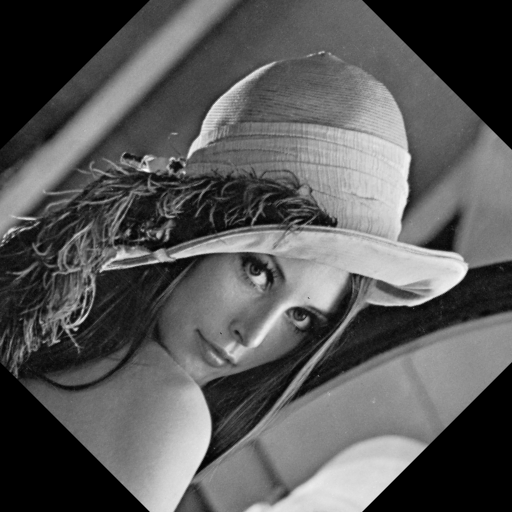
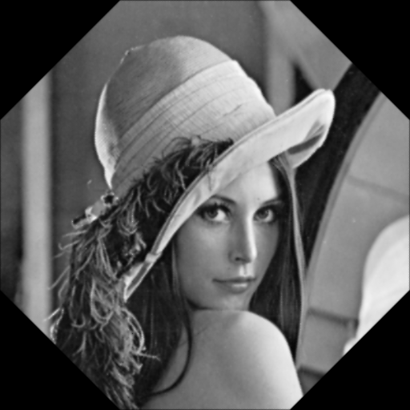
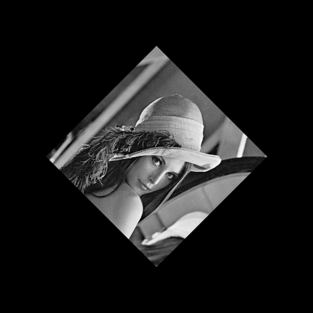
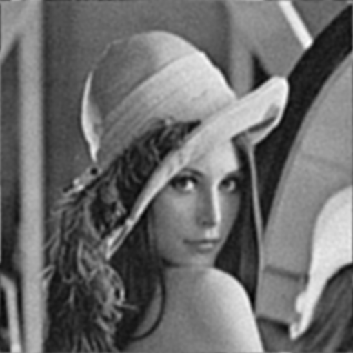
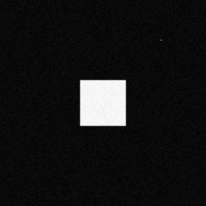

# TP2 - Questions (William Liaw)

<!-- arthur.lecair@telecom-paris.fr -->

## 2. Transformation géométrique

<!-- 1. Plus proche voisin (45)<br/>
   
2. Bilinéaire (45)<br/>
   
3. Plus proche voisin (45*8)<br/>
   
4. Bilinéaire (45*8)<br/>
   
5. Plus proche voisin (45) avec zoom<br/>
   
6. Bilinéaire (45) avec zoom<br/>
    -->


- Quelle différence y-a-t-il entre la méthode à plus proche voisin et la méthode bilinéaire?
  - Avec le méthode `a plus proche voisin, les lignes droites son perdues et l'image devient "pixelé", par contre avec le méthode bilinéaire l'image devient un peu flou parce que cette méthode fait des moyennages.
- Que constatez-vous sur une image qui aurait subi huit rotations de 45 degrés (en bilinéaire et en plus proche voisin)?
  - Dans une image que a subit 8 rotations de 45◦, résultant en une rotation de 360◦, les effets de chaque méthode sont intensifiés, l'image que a subit des rotations en plus proche voisin devient fortement pixelé et l'image que a subit des rotations en bilinéaire devient flou.
- Que constatez-vous si vous appliquez la rotation avec un facteur de zoom inférieur à 1 (par exemple 1/2)? Qu'aurait-il fallu faire pour atténuer l'effet constaté?
  - En appliquant la rotation avec un facteur de zoom inférieur `a 1 on observe du aliasing, ça se passe parce qu'on a sous-échantillonne l'image, donc, pour atténuer l'effet constaté on doit appliqué un filtre passe bas a l'image avant d'appliquer la rotation avec le zoom.

## Filtrage linéaire et médian

- Expliquer le rapport entre la taille du noyau (size) renvoyé par `get_gau_ker` et le paramètre cette commande.
  - Le paramètre du commande `get_gau_ker` est l'écart type de la gaussiene, théoriquement le filtre gaussien aura taille infini mais, comme il va a zéro rapidement le kernel peut être trunqué, donc le écart type détermine quand le filtre aura s'approché suffisamment de zéro pour être trunqué.
- Après avoir ajouté du bruit à une image simple telle que `pyramide.tif` ou carre `orig.tif` et avoir filtré le résultat avec des filtres linéaires, expliquez comment on peut évaluer (sur des images aussi simples) la quantité de bruit résiduel (la commande `var_image` donne la variance d'une partie d'une image).
  - Dans un image simple comme carre `orig.tif`, on a dans l'image de départ des régions homogènes avec variance originalement nulle donc, dans cette régions, la variance sera la variance du bruit.
- Appliquer un filtrage médian à une image bruitée et comparer le résultat avec un filtrage linéaire.
  - Quand on applique une filtrage médian, les lignes droites sont préserves mais les coins son dégrades, par contre, avec les filtrages linéaires, les bords devients flou. Aussi, en prenant des filtres linéaires e médians de même taille, on observe plus de bruit résiduel pour le filtre médian, il convient de mentionner que c'était du bruit additif qui a été ajouté
- Faites une comparaison linéaire/médian sur l'image `pyra-impulse.tif`. Que constatez-vous ?
  - L'image `pyra-impulse.tif` a subit du bruit impulsionnel, en appliquant les différents filtres on constate que les filtres linéaires ne sont pas efficace pour se genre de bruit, parce que le bruit n'est pas symétriquement distribué autour do valeur original du pixel, par contre le filtre médian est excellent
- Expliquer la différence de comportement entre filtrage linéaire et médian sur le point lumineux situé en haut à droite de l'image `carre_orig.tif`.
  - Avec la filtrage linéaire, le point lumineux devient une tache plus claire, ça se passe parce qu'un filtre linéaire fait un moyennage locale, donc le point lumineux impacte tous ça voisinage. Par contre, avec la filtrage médian le point disparaisse parce que le point lumineux est un outlier par rapport a ça voisinage donc il n'est jamais prise comme médian.

## 4. Restauration

- Appliquer un filtre linéaire à une image puis utilisez la fonction `filtre_inverse`. Que constatez-vous? Que se passe-t-il si vous ajoutez très peu de bruit à l'image floutée avant de la restaurer par la commande précédente?
  - En appliquant un filtre linéaire e après le filtre inverse, on récupère parfaitement l'image. Par contre, si on ajoute de bruit a l'image floutée avant de la restaurer, en appliquant le filtre inverse on perd totalement l'image.
- Comment pouvez-vous déterminer le noyau de convolution qu'a subi l'image `carre_flou.tif`?
  - Dans l'image carre orig.tif on observe un point lumineux, qui après application d'un filtre linéaire devient le noyau de convolution, donc pour déterminer le noyau il suffi de zoomer sur la tache dans carre flou.tif qui correspond au point lumineux et observer les nivaux de gris.
- Faites varier le paramètre $\lambda$ et commentez les résultats.
  - Avec $\lambda=0$, la fonction calcule le filtre inverse et on a une mauvaise restauration, en faisant grandir le paramètre $\lambda$, on obtient de meilleurs résultats jusqu'au point où on commence a surestimé le bruit et l'image dévient flou.

<!-- 1. Wiener - Bruit sous-estimé<br/>
   
1. Wiener - Bruit sur-estimé<br/>
   
2. Wiener - Bruit bien-estimé<br/>
    -->

## 5. Applications

### 5.1. Comparaison filtrage linéaire et médian

<!-- 1. Carré - Médian circulaire de rayon 4<br/>
   
2. Carré - Noyau constant 4<br/>
    -->

- Pour une image simple telle que `carre-orig.tif` et un bruit d'écart-type 5, trouver la taille du noyau constant qui réduit le bruit dans les mêmes proportions qu'un filtre médian circulaire de rayon 4.
  - La taille du noyau constant qui réduit le bruit dans les mêmes proportions qu'un filtre médian circulaire de rayon 4 est $s = 2$. L'algorithme utilisé évalue la variance d'un morceaux de l'image originalement homogène, de cette façon la variance correspond `a la variance du bruit résiduel, en variant la taille du noyau constant, on peut déterminer pour quelle taille la variance du bruit résiduel s'approche le plus de celle du le filtre médian.

### 5.2. Calcul théorique du paramètre de restauration

- Modifiez la fonction `wiener` afin qu'elle utilise le spectre de l'image dégradée à place de lambda*omega^2.

  ```python
  def wienerMod(im, K, sigmaB2=0):
      fft2 = np.fft.fft2
      ifft2 = np.fft.ifft2
      (ty, tx) = im.shape
      (yK, xK) = K.shape
      KK = np.zeros((ty, tx))
      KK[:yK, :xK] = K
      x2 = tx / 2
      y2 = ty / 2

      fX = np.concatenate((np.arange(0, x2 + 0.99), np.arange(-x2 + 1, -0.1)))
      fY = np.concatenate((np.arange(0, y2 + 0.99), np.arange(-y2 + 1, -0.1)))
      fX = np.ones((ty, 1)) @ fX.reshape((1, -1))
      fY = fY.reshape((-1, 1)) @ np.ones((1, tx))
      fX = fX / tx
      fY = fY / ty

      w2 = fX**2 + fY**2
      w = w2**0.5

      g = fft2(im)
      k = fft2(KK)

      sigmaS2 = g**2

      mul = np.conj(k) / (abs(k) ** 2 + sigmaB2/sigmaS2)
      fout = g * mul

      mm = np.zeros((ty, tx))
      y2 = int(np.round(yK / 2 - 0.5))
      x2 = int(np.round(xK / 2 - 0.5))
      mm[y2, x2] = 1
      out = np.real(ifft2(fout * (fft2(mm))))
      return out
  ```
