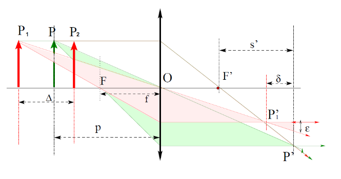

# Études

## Acquisition photographique

- $\frac{1}{f}=\frac{1}{d_o}+\frac{1}{d_i}$
  - $f$ est la distance focale de la lentille,
  - $d_o$ est la distance de l'objet à la lentille,
  - $d_i$ est la distance de l'image à la lentille
- Grandissement: $\gamma=\frac{h_i}{h_o}=\frac{d_i}{d_o}$
  - $h_i$​ est la hauteur de l'image,
  - $h_o$​ est la hauteur de l'objet.
- Profondeur de champ: $\Delta=\frac{2\epsilon Dpf(p-f)}{d^2f^2-\epsilon^2(p-f)^2}$, c'est la distance séparant l'objet net le plus proche de l'appareil de l'objet net le plus lointain
  - En supposant que $\delta\ll s$ et $f\ll p$: $\Delta\approx\frac{2\epsilon p^2}{Df}$

- Nombre d'ouverture: $N=\frac{f}{D}$
  - Plus fréquemment notée: $f / N$
  - $D$ est le diamètre du diaphragme
  - Quand N augmente (à $f$ constant):
    - La profondeur de champs augmente
    - Les défauts de diffraction augmentent
    - Les défauts de vignettage diminuent
- Ringing (suroscillation): si on réalise une filtrage passe-bas parfaite et après on récupère l'image on tient $\mathcal{F}^{-1}(\mathcal{F}(f)\mathbb{1}_K)=f*\mathcal{F}^{-1}(\mathbb{1}_K)$, où $\mathbb{1}_K$ est la fonction indicatrice d'un carré. Donc, $\mathcal{F}^{-1}(\mathbb{1}_K)$ est le produit de deux fonctions $\text{sinc}$ (décroissance lente).

## Contraste - couleur

- Un changement de contraste consiste à transformer une image $u$ en l'image $g\circ u$, avec $g$ une fonction strictement croissante
- L'aspect global de l'image n'est pas changé par l'application de fonctions croissants, contrairement a l'application de fonctions décroissants. Ça ce passe parce que nous sommes sensibles aux contrastes locaux, bien plus qu'aux contrastes globaux, pour ça la perception du contenu d'une image ne change pas si l'on applique une fonction croissante puisque le signal du gradient ne change pas.
- HSV
  - Teinte H: attribut de la sensation visuelle qui a suscité les dénominations de couleur
  - Saturation S: attribut permettant d'estimer la proportion de couleur chromatiquement pure contenue das la sensation totale. Caractérise le côté plus ou moins "délavé", dégrée de melange de la longueur d'onde prédominante avec le blanc
  - Luminance V: attribut de la sensation visuelle selon lequel une surface éclairée par une source lumineuse déterminée paraît émettre plus ou moins de lumière. Correspond à l'aspect clair, foncé ou terne d'une couleur

## Interpolation

- Bilinéaire: $(\gamma y + \delta(1 - y))x + (\alpha y + \beta(1 - y))(1-x)$
- Bicubique: $g(x,\ y)=\sum\limits_{k,\ l}c(k,\ l)\beta^3(x-k)\beta^3(y-l)$
  $$
  \begin{align*}
  \beta^3(x) =
    \begin{cases}
      \frac{2}{3} - |x|^2+\frac{ |x|^3 }{2},\ |x|\leq1 \\
      \frac{(2-|x|)^3}{6},\ 1\leq|x|\leq 2 \\
      0,\ 2\leq|x|
    \end{cases}
  \end{align*}
  $$
  - Les $c(k,\ l)$ sont obtenus de manière séparable
    - $f_n=c*b$
    - $B(z)=\frac{z^-1+4+z}{6}=\frac{1}{-6z_1}(1-z_1z^{-1})(1-z_1z),\ z_1=-2+\sqrt{3},\ |z_1|<1$
      - On applique deux filtres récursifs: l'un causal et l'autre non causal pour obternir les $c(k)$ aux prix de quelques opérations par échantillon
- Shannon: $\frac{1}{N^2}\sum\limits_{k\ l}\hat{f}_{k\ l}\exp(2i\pi\big(\frac{k}{N}x\frac{l}{y}\big))$
  - $\hat{f}_{k\ l}$ coefficient de Fourier

## Morphologie mathématique

- Binary dilation: $D(X,\ B)=X\oplus B=\{x+b\ |\ x\in X,\ b\in B\}$
- Binary erosion: $E(X,\ B)=X\ominus B=\{x\ |\ \forall b\in B;\ x+b\in X\}$
- Erosion and dilation are both increasing with respect to the image
  - $X\subseteq Y\Rightarrow D(X,\ B)\subseteq D(Y,\ B)$
  - $X\subseteq Y\Rightarrow E(X,\ B)\subseteq E(Y,\ B)$
    - Erosion is decreasing with respect to B
- Dilation commutes with union but not with intersection: $D(X\cup Y,\ B)=D(X,\ B)\cup D(Y,\ B)$, $D(X\cap Y,\ B)\subseteq D(X,\ B)\cap D(Y,\ B)$
- Erosion commutes with intersection but not with union: $E(X\cap Y,\ B)=E(X,\ B)\cap E(Y,\ B)$, $E(X\cup Y,\ B)\supseteq E(X,\ B)\cup E(Y,\ B)$
- Extensibility: if B contains its origin
  - The dilation is extensive: $X\subseteq D(X,\ B)$
  - The erosion is anti-extensive: $X\supseteq E(X,\ B)$
- Iteration property:
  - $D(D(X,\ B),\ B')=D(X,\ B\oplus B')$
  - $E(E(X,\ B),\ B')=E(X,\ B\oplus B')$
- Duality: $E(X,\ B)=D(X^C,\ B)^C$
- Binary opening: $X_B=D(E(X,\ B),\ B)$
- Binary closing: $X^B=E(D(X,\ B),\ B)$
- Opening and closing are both increasing with respect to the image
  - $X\subseteq Y\Rightarrow X_B\subseteq Y_B$
  - $X\subseteq Y\Rightarrow X^B\subseteq Y^B$
- Idempotent: applying twice is the came as applying once
  - $(X_B)_B=X_B$
  - $(X^B)^B=X^B$
- Extensibility:
  - Opening is anti-extensive: $X_B\subseteq X$
  - Closing is extensive: $X^B\supseteq X$
- Duality: $X^B=((X^C)_B)^C$
- $\cup\rightarrow \sup$
- $\cap\rightarrow \inf$
- $\subset\rightarrow \leq$
- $\supset\rightarrow \geq$

## Restauration

- $g=Af+b$
  - $f\in\mathbb{R}^{N^2}$: image de taille $N\times N$ inconnue
  - $g\in\mathbb{R}^{N^2}$: image de taille $N\times N$ connue
  - $A$: matrice de convolution carré de taille $N^2\times N^2$
  - $b\in\mathbb{R}^{N^2}$: réalisation d'un bruit gaussien
- Résolution Wiener
  - $Y=AX + B$, trouver $\tilde{X}=DY$ tel que $E(||\tilde{X} - X||^2)$ soit minimale
  - $\tilde{X}=(A^TA+\sigma_b^2C^{-1})^{-1}A^TY$
  - $\hat{\tilde{f}}(\omega)=\frac{\overline{\hat{K}(\omega)}}{|\hat{K}(\omega)|^2+\frac{\sigma_b^2}{\sigma_s^2(\omega)}}\hat{g}(\omega)$
  - $Af:=K*f$
- Approche par minimisation d'énergie
  - $E(\tilde{f})=||A\tilde{f}-g||^2+\lambda R(\tilde{f})$
    - Régularité, par exemple $\int||\nabla\tilde{f}||^2$
      - Donne: $\hat{\tilde{f}}(\omega)=\frac{\overline{\hat{K}(\omega)}}{|\hat{K}(\omega)|^2+\lambda\omega^2\sigma_b^2}\hat{g}(\omega)$

## Représentation et analyse de formes

- Pour une forme $A\subset\mathbb{R}^2$, on s'intéresse à des descripteurs numériques: $\phi:\mathcal{P}(\mathbb{R}^2)\rightarrow\mathbb{R}^p$
- $\phi$ est invariant à $T$ si $\phi(TA)=\phi(A)$
- Une transformation affine est une application du plan dans lui-même définit par $X\rightarrow MX+P$, avec $M$ une mactrice inversible et $P$ un vecteur
- Exemples de descripteurs gloubaux
  - Périmètre $P(A)$, surface $S(A)$, rapport isopérimétrique: $R=\frac{4\pi S(A)}{P(A)}$
  - Diamètre: $\sup\limits_{x,y\in A}d(x,\ y)$
- Moments: $m_{p,\ q}(A) = \int\int_{A}(x − x_c)^p(y − y_c)^q\ dx\ dy$
  - $(x_c,\ y_c)$ coordonnées du centre d'inertie de la forme:
    - $x_c=\frac{1}{S(A)}\int\int_A x\ dx\ dy$
    - $y_c=\frac{1}{S(A)}\int\int_A y\ dx\ dy$
- Normalisation pour une invariance au zoom: $n_{p,\ q}=\frac{m_{p,\ q}}{m_{0,\ 0}^\alpha}$c avec $\alpha=\frac{1}{2}(p+q)+1$
- Normalisation supplémentaire pour les rotations: $h_1=n_{2,\ 0}+n_{0,\ 2}$ et $h_1=(n_{2,\ 0}+n_{0,\ 2})^2+4n_{1,\ 1}^2$
- Partant de $\{p_1,\ \dots,\ p_n\}$ ensemble de points, on cherche des formes paramétrées dans $\{F_\theta, \theta\in\Theta\}$
  - Transformée de Hough: $p_i\rightarrow\mathcal{C}_i\subset\Theta$, avec $\mathcal{C}_i=\{\theta:p_i\in F_{\theta}\}$. Puis, on s'intéresse à $\sum\limits_{i=1}^n\mathbb{1}(\mathcal{C}_i)$ votes des points pour les formes paramétrées
  - $y=ax+b$ est une mauvaise paramétrisation
    - $a, b\in(-\infty, \infty)$
    - Les variations sur $a$ et $b$ ne correspondent pas à des variations uniformes dans l'espace image
  - On choisit $x\cos(\theta)+y\sin(\theta)=\rho$
    - $\theta$ borné, $\rho$ borné pour une image bornée
    - $d\theta$ rotation dans le plan image
    - $d\rho$ translation dans le plan image
- Random Sample Consensus (RANSAC)
  - Données $p_i=(x_i,\ y_i)$
  - Initialisation $\Delta=\varnothing$, $N=0$
  - On itère
    - $p_i, p_j$ tirés au hasard $\rightarrow$ droite $\Delta_{i,\ j}$
    - $N_{i,\ j}=\{p_k:d(p_k,\ \Delta_{i,\ j})\leq\epsilon\}$
    - Si $N_{i,\ j}>N:\Delta=\Delta_{i,\ j}, N=N_{i,\ j}$

## Descripteurs locaux

- Scale invariant feature transform (SIFT) descriptors
  - Construction of a local descriptor $a$ at each interest point $(\overrightarrow{x},\ \sigma,\ \theta)$
    - Over a mask around $\overrightarrow{x}$:
      - $M$ sectors ($M=4\times 4=16$ in the original SIFT)
      - Size proportional to $sigma$: scale invariance
      - Orientations computed with respect to $\theta$: rotation invariance

## Segmentation

- Approche continue des contours: gradient
  - Image supposée continue: $i(x,\ y)$
    - $\overrightarrow{G}=\overrightarrow{\nabla}i = \big(\frac{\partial i}{\partial x},\ \frac{\partial i}{\partial y}\big)$
    - Module du gradient: $G=|\overrightarrow{\nabla}i|=\sqrt{\big(\frac{\partial i}{\partial x}\big)^2 + \big(\frac{\partial i}{\partial y}\big)^2}$
    - Direction du gradient: $\overrightarrow{g}=\frac{\overrightarrow{\nabla}i}{|\overrightarrow{\nabla}i|}$
    - Contour lieu des maxima du gradient dans la direction $\overrightarrow{g}$ du gradient
    - Masques de gradient
      - Différence
      - Roberts
      - Prewitt
      - Sobel
    - Le filtre Sobel met l'accent sur les pixels les plus proches du centre du masque, car pour obtenir le opérateur de Sobel, on effectue un produit externe entre un filtre gaussien 1D et la dérivée (difference). Le filtre gaussien est utilisé pour réduire le bruit qui donne des images floues. Ainsi, l'opérateur Sobel calcule le gradient de l'image avec moins de bruit. L'opérateur Sobel est basé sur la convolution de l'image avec un petit filtre séparable et à valeurs entières dans les directions horizontale et verticale et est donc relativement peu coûteux en termes de calculs. Il en va toutefois de même pour le filtre des différences, qui nécessite encore moins de puissance de calcul. Le filtre de différence simple ($2\times 2$), qui calcule la différence entre deux pixels voisins, est centré entre les pixels, ce qui provoque un décalage de l'image. En introduisant une colonne (ou une ligne) de zéros entre les coefficients asymétriques, le filtre Sobel ($3\times 3$) est centré sur le pixel lui-même.
- Les critères de Canny définissent analytiquement les caractéristiques souhaitables pour la détection de contours:
  - une bonne détection, autant de bords que possible doivent être détectés avec précision, ce qui signifie que le détecteur doit avoir une réponse forte même aux contours faibles et doit maximiser le rapport signal sur bruit: $\Sigma=\frac{\int_0^\infty f(x)\ dx}{\sqrt{\int_{-\infty}^\infty f^2(x)\ dx}}$
  - bonne localisation, les points détectés doivent être au centre du contour: $\Lambda=\frac{|f'(0)|}{\sqrt{\int_{-\infty}^\infty f'^2(x)\ dx}}$
  - réponse unique, chaque contour ne doit être détecté qu'une seule fois et le bruit ne doit pas créer de faux contours: $x_{\max}=2\pi\sqrt{\frac{\int_{-\infty}^\infty f'^2(x)\ dx}{\int_{-\infty}^\infty f''^2(x)\ dx}}$
  - Maximiser $\Sigma\Lambda$ avec $x_{\max}=k$ (cte)
- Filtre de Deriche
  - $\Lambda=\sqrt{2\alpha};\ \Sigma=\sqrt{\frac{2\alpha}{\alpha^2+\omega^2}}$
- Laplacien
- Fermeture des contours: hystérésis
- Approches sur l'histogramme
  - $+$ simple
  - $+$ adapté à plusieurs dimensions
  - $-$ pour images sans bruit
  - Approches supervisées
  - Approches automatiques
- Classification bayésienne
  - Introduction d'une fonction de coût
    - $\Omega=\{\omega_1,\ \omega_2\}$
    - Pondération des classes: coûts de mauvaise classification: $C_i$ coût de la mauvaise classification de la classe $i$
    - $\Gamma(t)=C_1\int_1^NP(\omega_1)P(y|\omega_1)\ dy + C_2\int_0^tP(\omega_2)P(y|\omega_2)\ dy$
    - Choix du seil que minimise la fonction de coût $\frac{\partial\Gamma (t)}{\partial t}=0$: $C_1P(\omega_1)P(y|\omega_1) - C_2P(\omega_2)P(y|\omega_2)$
  - Seuillage de Neyman-Pearson
    - Probabilité de fausse alarme pour un seuil $t$ donnée: $P_{fa}=\int_0^tP(\omega_2)P(y|\omega_2)\ dy$
    - Probabilité de détection: $P_d=\int_0^tP(\omega_1)P(y|\omega_1)\ dy$
- Classification automatique
  - Fingerprint
    - Recherche des maxima et minima locaux pour définir les classes sur l'histogramme
    - Traitement du bruit: filtrage de l'histogramme avec des gaussiennes
  - K-moyennes
    - Minimisation de la dispersion intra-classe
    - Pas de preuve de convergence vers l'optimum global
- Seuillage automatique
  - Choix d'un critère à optimiser
  - Parcours exhaustif de toutes les possibilités

## Annales

### Acquisition photographique

- On effectue la mise au point sur un objet à une distance $D$ de l'appareil photo. Puis on augmente $D$. Pour faire la mise au point, faut-il rapprocher le plan du capteur de la lentille ou l'éloigner? Justifiez.
  - $\frac{1}{f}=\frac{1}{D}+\frac{1}{d_i}$, donc si on augmente la distance $D$ on doit rapprocher le plan du capteur ($d$) pour respecter la distance focale.
- On considère une lentille mince de distance focale égale à $5$ cm. Pour qu'un objet à très grande distance (à l'infini) soit net, quelle doit être la distance entre la lentille et le plan image (le capteur)?
  - $\frac{1}{f}=\frac{1}{\infty}+\frac{1}{d_i}\approx\frac{1}{d_i}$, donc si la distance $D$ été $\infty$, la distance du plan du capteur ($d_i$) doit être égale à distance focale ($f$).
- On considère toujours la même lentille (focale $5$ cm). On suppose maintenant que la distance de la lentille au plan image (le capteur) est fixe, égale à $6$ cm. On photographie un objet de hauteur de $10$ cm. On dispose d'un capteur de taille $24 \times 36$ mm, de $2400$ pixels sur $3600$ pixels. A quelle distance de la lentille faut-il placer l'objet? Quelle est la hauteur de l'image de l'objet, en pixels?
  - $\frac{1}{5}=\frac{1}{d_o}+\frac{1}{6}\Rightarrow d_o=30$ cm. On doit placer l'objet à $30$ cm de la lentille.
  - $\frac{h_i}{10}=\frac{6}{30}\Rightarrow h_i=2$ cm. Alors, en multipliant $h_i$​ par le nombre de pixels par centimètre, nous obtenons la hauteur de l'image en pixels: $h_{i,\ px}=2\cdot1000=2000$ pixels.
- On considère une lentille mince de distance focale égale a $5$ cm. On photographie un objet de hauteur $10$ cm, placé à $10$ cm de la lentille. Quelle est la position de l'image de l'objet? quelle est la hauteur de l'image de l'objet sur le capteur?
  - $\frac{1}{5}=\frac{1}{10}+\frac{1}{d_i}\Rightarrow d_i=10$ cm est la position de l'image de l'objet. Alors, $\frac{h_i}{10}=\frac{10}{10}\Rightarrow h_i=10$ cm est la hauteur de l'image de l'objet sur le capteur.
- Pour augmenter la profondeur de champ, doit-on augmenter ou diminuer la taille de l'ouverture?
  - Pour augmenter la profondeur de champ, on doit recourir à une ouverture de taille plus petite
- Si une image est aliasée (a subi un repliement de spectre), peut-on supprimer les défauts grâce à un filtrage passe-bas de cette image?
  - L'aliasing se produit lorsqu'une fréquence d'image dépasse la moitié de la fréquence d'échantillonnage (fréquence de Nyquist) dans le processus de numérisation. Le repliement de spectre se produit lorsque des fréquences supérieures à la fréquence de Nyquist sont repliées et confondues avec des fréquences plus basses (sous-échantillonnage).
    - En appliquant un filtre passe-bas, on peut atténuer les hautes fréquences de l'image, réduisant ainsi les artefacts d'aliasing. Cependant, cela peut également entraîner une perte de netteté générale de l'image, car des détails fins peuvent également être supprimés. Donc, oui, dans certains cas, il est possible de réduire les effets de l'aliasing (repliement de spectre) en appliquant un filtrage passe-bas à l'image avant de l'échantillonner. Cependant, il est important de noter que le filtrage ne peut pas récupérer complètement les détails perdus lors du repliement de spectre. Le filtrage peut aider à atténuer les artefacts visuels, mais cela se fait au détriment de la netteté de l'image. L'efficacité du filtrage dépend du type d'aliasing présent dans l'image et de la complexité de la scène photographiée. Dans certains cas, un filtrage adaptatif ou d'autres techniques de post-traitement peuvent être nécessaires pour minimiser les effets d'aliasing tout en préservant les détails importants de l'image.
    - Si on applique le filtre après l'échantillonnage, non, la filtrage n'aide pas du tout à supprimer les défauts de l'image aliasée.
- Donner un exemple de filtre passe-bas produisant du ringing. Quel type de filtre permet de limiter le phénomène?
  - Un filtre passe-bas parfait est un exemple de filtre qui produit du ringing. En effet, un filtre passe-bas parfait correspond, dans le domaine de Fourier, à une fonction indicatrice d'un carré par exemple. Si nous obtenons sa représentation dans le domaine fréquentiel, nous obtenons une fonction sinusoïdale (bidimensionnelle) qui a un support infini et une décroissance lente. La convolution résultante entre l'image filtrée et la fonction sinusoïdale produit donc des artefacts de sonnerie indésirables. Des filtres continus, sur le domaine de Fourier, comme le filtre gaussien ou le filtre de Hann, permettraient de limiter les effets d'un tel phénomène.
- Pourquoi doit-on faire passer la lumière issue d'une scène par une petite ouverture avant de l'enregistrer sur le plan focal? Quelle image obtiendrait-on si on mettait un capteur photo-sensible directement face à une scène?
  - Le processus de faire passer la lumière d'une scène à travers une petite ouverture avant de l'enregistrer sur un plan focal est lié à la formation d'une image nette et précise. En utilisant une petite ouverture (une ouverture plus petite du diaphragme), on réduit la quantité de lumière qui atteint le plan focal à partir de chaque point de la scène, mais on améliore la netteté de l'image globale. Cela se fait aux dépens de la quantité de lumière qui atteint le capteur ou le film, mais cela permet d'obtenir une image plus précise avec une meilleure résolution. Cependant, lorsque la lumière traverse une ouverture excessivement petite, comme l'ouverture d'un diaphragme de taille comparable à sa longueur d'onde, elle subit la diffraction. Si cela s'est produit, des motifs de diffraction indésirable apparaissent.
  - Si un capteur photo-sensible était directement exposé à une scène sans utiliser une petite ouverture, la lumière de chaque point de la scène se répandrait largement sur le capteur, conduisant à une image complètement floue et très peu définie. L'utilisation d'une ouverture permet de contrôler les rayons lumineux entrant et de former une image nette et bien définie sur le plan focal.

### Contraste - couleur

- Quel est l'effet de la transformation $I\rightarrow 255-I$ sur l'histogramme d'une image $I$? Notre perception visuelle est-elle sensible à ce type de changement?
  - L'aspect global de l'image n'est pas changé par l'application de fonctions croissants, contrairement a l'application de fonctions décroissants. Ça ce passe parce que nous sommes sensibles aux contrastes locaux, bien plus qu'aux contrastes globaux, pour ça la perception du contenu d'une image ne change pas si l'on applique une fonction croissante puisque le signal du gradient ne change pas.
- Montrer que l'orientation du gradient de $u$, définie par $\phi=\arctan\bigg(\frac{\frac{\partial u}{\partial y}}{\frac{\partial u}{\partial x}}\bigg)$ est invariante à tout changement de contraste. On rappelle qu'un changement de contraste consiste à transformer une image $u$ en l'image $g\circ u$, avec $g$ une fonction strictement croissante. Quel peut-être l'intérêt pratique de cette invariance  Donnez un exemple d'application où cette invariance est importante.
  - $\nabla(g\circ u) = \big(\frac{\partial(g\circ u)}{\partial x}, \frac{\partial(g\circ u)}{\partial y}\big)=g'(u)\big(\frac{\partial u}{\partial x}, \frac{\partial u}{\partial y}\big)\Rightarrow \phi'=\arctan\bigg(\frac{\frac{\partial u}{\partial y}}{\frac{\partial u}{\partial x}}\bigg)=\phi$
  - Voici quelques exemples d'applications où cette invariance est importante:
    - Reconnaissance d'objets sous différentes conditions d'éclairage: Lorsque vous prenez des photos dans des conditions d'éclairage variables, le contraste de l'image peut changer. L'invariance du gradient par rapport au contraste permet de concevoir des algorithmes de reconnaissance d'objets qui ne sont pas sensibles aux variations de contraste. Ainsi, un objet peut être identifié de manière robuste même si l'éclairage change.
    - Suivi d'objets dans des vidéos: Lors du suivi d'objets dans une séquence vidéo, le contraste peut varier en raison de changements d'éclairage ou d'autres facteurs. L'invariance du gradient par rapport au contraste est utile pour maintenir la cohérence du suivi, permettant aux algorithmes de suivre un objet malgré les variations de contraste au fil du temps.
    - Correspondance d'images: Dans des tâches telles que la correspondance d'images pour la reconstruction 3D ou la stéréovision, l'invariance au contraste garantit que des points similaires dans deux images présentant des contrastes différents peuvent être appariés correctement.
    - Détection de contours robuste: Lors de la détection de contours dans des images, il est souvent préférable d'être invariant au contraste pour identifier les caractéristiques structurelles importantes d'une scène, indépendamment des variations de luminosité.
- On considère le changement de contraste suivant (transformation affine):
 $I \rightarrow a I + b$, avec a et b des valeurs numériques. On considère une image $I$ codée sur $8$ bits et on note $m$ et $M$ respectivement le minimum et maximum des niveaux de gris de $I$. Donnez les valeurs de $a$ et $b$ en-dessus qui permettent de transformer l'image de manière à ce que minimum et maximum soient respectivement 0 et 255. On appelle le résultat « étirement » d'histogramme (histogramme stretching en anglais).
  - $a\cdot m + b = 0$ et $a\cdot M + b = 255\therefore a=\frac{255}{M-m},\ b=-a\cdot m$.
- A quoi peut servir une telle transformation?
  - L'étirement d'histogramme permet d'utiliser toute la plage dynamique disponible, améliorant ainsi le contraste de l'image. Cela peut être utile pour visualiser des détails dans des régions sombres ou claires de l'image qui pourraient être difficilement discernables sans cet ajustement. Il peut également être utilisé comme prétraitement pour certaines tâches d'analyse d'image, car il accentue les différences de niveaux de gris.
- Commentez les différences entre cette transformation et l'égalisation d'histogramme. On pourra s'aider de dessins et/ou d'histogrammes simples.
  - Étirement d'histogramme
    - Objectif: Étendre la plage dynamique des niveaux de gris de l'image pour utiliser toute la gamme disponible
    - Transformation: $J=aI+b$, avec $a$ et $b$ calculés pour que le minimum soit transformé en $0$ et le maximum en $255$
    - Effet: Les pixels de l'image sont linéairement étirés pour occuper toute l'échelle de niveaux de gris, ce qui augmente le contraste
    - Histogramme: L'histogramme original est étiré vers les bords de la gamme dynamique, mais il ne change pas de forme
    - Reversible
  - Égalisation d'histogramme
    - Objectif: Répartir uniformément les niveaux de gris dans l'image pour maximiser le contraste.
    - Transformation: Utilisation de la fonction de transformation cumulative de l'histogramme
    - Effet visuel: Accentuation des détails en augmentant et améliorant le contraste entre les niveaux de gris
    - Histogramme: L'histogramme est égalisé, ce qui signifie qu'il est réparti uniformément sur toute la gamme dynamique
    - Aucun moyen de récupérer l'image d'origine
    - L'histogramme cumulée se rapproche de l'identité et dans l'histogramme, par rapport au histogramme de l'image originale, on observe que les barres sont décalées de manière a devenir a peut près constant, si on considère les moyennes ou la densité
- Quel sont les avantages de l'espace de couleur HSV? Donnez un exemple où un tel espace est utile
  - L'espace de couleur HSV (Teinte, Saturation, Valeur) présente plusieurs avantages par rapport à d'autres espaces de couleur, tels que l'espace RGB (Rouge, Vert, Bleu). Voici quelques-uns de ses avantages et un exemple d'application:
    - Avantages de l'espace de couleur HSV:
      - Séparation des composantes perceptuelles: L'espace HSV sépare la teinte, la saturation et la luminance (ou valeur), ce qui correspond mieux à la perception humaine des couleurs. Cela facilite la manipulation des couleurs d'un point de vue perceptuel.
      - Intuitif pour la manipulation des couleurs: La composante de teinte représente la couleur elle-même, la saturation mesure la pureté de la couleur, et la valeur représente la luminosité. Ces composantes sont plus intuitives pour la modification des couleurs que les valeurs RGB, qui sont souvent moins liées à la perception humaine des couleurs.
      - Facilité de modification de la luminosité et de la saturation:
        - En modifiant la valeur, on peut facilement ajuster la luminosité de la couleur sans changer la teinte ou la saturation.
        - En modifiant la saturation, on peut ajuster l'intensité de la couleur sans changer la teinte ni la luminosité.
      - Séparation de la chrominance et de la luminance:
        - L'espace HSV sépare la couleur (teinte et saturation) de la luminosité, ce qui est utile dans de nombreuses applications, y compris le traitement d'images et de vidéos.
    - Exemple d'application:
      - Correction sélective des couleurs:
        - L'espace de couleur HSV est souvent utilisé pour des opérations telles que la correction sélective des couleurs. Par exemple, si vous avez une image où vous voulez ajuster la saturation ou la luminosité d'une couleur spécifique, il est plus simple de le faire dans l'espace de couleur HSV.
        - Supposons que vous ayez une image photographique et que vous vouliez augmenter la saturation des couleurs sans changer la luminosité. Utiliser l'espace HSV facilitera cet ajustement, car vous pouvez simplement augmenter la saturation sans toucher à la teinte ou à la luminosité, ce qui pourrait être plus compliqué dans l'espace RGB.
- On rappelle que pour comparer (pixel à pixel) deux images A et B en niveaux de gris, nous avons vu en cours et en TP une technique (la prescription d'histogrammes) qui permet de modifier B pour qu'elle ait le même histogramme que A. Comment adapteriez-vous cette technique pour comparer (pixel à pixel) deux images A et B en couleur?
  - Pour une image en couleur, la couleur va être encodé sur 3 canaux R G B, on peut ainsi appliquer le même algorithme mais pour chaque canal (qui correspond à un tableau différent), et puis faire un norme ou un sommatoire des trois.
- On ajoute un bruit gaussien i.i.d. à une image. Décrire et expliquer l'effet de cette opération sur l'histogramme de l'image.
  - En considérant les niveaux de gris d'une image comme la réalisation d'une variable aléatoire $X$ dont la loi $P_X$ est l'histogramme de l'image, quand on ajoute un bruit gaussien (variable aléatoire $Y$ dont la loi $P_Y$ est gaussien), la distribution de la variable aléatoire résultant $X+Y$ sera la convolution $P_X * P_Y$. De cette façon, le histogramme déviant plus lisse.

### Interpolation

- Donner la formule d'interpolation bilinéaire. On suppose que les valeurs aux pixels entiers de position $(0,\ 0)$, $(0,\ 1)$, $(1,\ 1)$ et $(1,\ 1)$ sont $\alpha$, $\beta$, $\gamma$, $\delta$ et que le point où l'on veut interpoler est de coordonnées $(0,\ 0) \leq (x,\ y) \leq (1,\ 1)$.
  - $(\gamma y + \delta(1 - y))x + (\alpha y + \beta(1 - y))(1-x)$
- Combien faut-il d'opérations pour effectuer un zoom par Fourier (zéro-padding) d'un facteur $2$ d'une image de taille $N \times N$? Expliquer les étapes du calcul.
  - Pour effectuer un zoom par Fourier avec un facteur 2 (zéro-padding) d'une image de taille $N \times N$, le nombre d'opérations nécessaires dépend du nombre d'opérations requises pour calculer la transformée de Fourier discrète (DFT) de l'image originale et du coût du zéro-padding. Voici les étapes du calcul:
    - Calcul de la DFT de l'image originale: La DFT de l'image originale de taille $N \times N$ nécessite $N^2 \log_2(N^2)$ opérations à l'aide de l'algorithme FFT (Fast Fourier Transform).
      - Zéro-padding: Le zéro-padding consiste à ajouter des zéros autour de l'image originale, augmentant ainsi sa taille. Dans le cas d'un zoom par un facteur de 2, on double la taille de l'image dans chaque dimension.
      - Si l'image originale était de taille $N \times N$, après le zéro-padding, elle devient $2N \times 2N$.
      - Le zéro-padding lui-même n'ajoute pas d'opérations significatives, car il consiste simplement à ajouter des zéros dans l'image, ce qui peut être fait avec un coût négligeable.
    - Calcul de la DFT de l'image avec zéro-padding: La DFT de l'image avec zéro-padding de taille $2N \times 2N$ nécessite $(2N)^2 \log_2((2N)^2)$ opérations à l'aide de l'algorithme FFT.
    - Total des opérations: En combinant les opérations nécessaires pour calculer la DFT de l'image originale et celle de l'image avec zéro-padding, on obtient le total des opérations nécessaires pour effectuer le zoom par Fourier avec un facteur 2.
      - Au final $O(N^2\log_2N)$
- Combien d'opérations faut-il effectuer pour calculer une interpolation bilinéaire en un point réel $(x,\ y)$ (on ne compte que les opérations de multiplication)? Même question pour l'interpolation bicubique (l'image d'origine est de taille $N \times N$ pixels).
  - Interpolation bilinéaire: il faut $4$ opérations par pixel
  - Interpolation bicubique: si l'image d'origine est de taille carrée $N\times N$ il faut créer le tableau des $c_{n,\ k}$ pour un temps de calcul d'à peu près $4N^2$ opérations. Puis pour chaque pixel de l'image il faut $16$ opérations par pixel (on va chercher les $16$ pixels plus proches et on les moyenne en utilisant le $c_{n,\ k}$) $\therefore 4N^2 + 16N^2$. Il est important de remarquer que les calculs de tous les coefficients $c_{n,\ k}$ ne sont pratiques que s'il est destiné à faire de nombreuses valeurs d'interpolations.
- Et si on souhaite faire un zoom de facteur 2, combien faut-il faire d'opérations au total si on utilise l'interpolation bilinéaire ou si on utilise l'interpolation bicubique?
  - Pour un zoom bilinéaire fois 2: $\frac{3}{4}\cdot(2N\times 2N)\cdot 4= 12 N^2$
  - Pour un zoom bicubique fois 2: $4N^2 + \frac{3}{4}16N^2$

### Morphologie mathématique

- Quel est le résultat de la dilatation de B2 par B1 (en considérant que l'origine est au centre de l'élément structurant) ?
  - L'addition de Minkowski des éléments $B_2\oplus B_1$
- Décrire le lien entre les dilatations et les cartes de distance. Quel est l'intérêt de ce lien ?
  - Morphological dilations and distance maps are related by the fact that dilation can be seen as the propagation of distance information from the edges of objects. This connection is useful for obtaining accurate distance maps, which, in turn, facilitates precise segmentation of objects in an image. Distance maps also enable geometric and topological analysis, as well as the computation of important attributes for various applications. In summary, the relationship between dilations and distance maps facilitates a detailed analysis of the spatial arrangement of objects in an image.

### Restauration

- Quel effet visuel se produit si on se trompe en supposant, lors de la restauration, que le bruit est plus grand que ce qu'il était dans la réalité ? Même question si on suppose le bruit plus faible que dans la réalité ?
  - Si nous faisons de mauvaises estimations du flou (sous-estime ou surestime), l'image restaurée devient floue
- Quel filtre, que vous avez utilisé en TP, est le plus adapté au débruitage de bruit "impulsionnel" ?
  - Avec la filtrage linéaire, le point lumineux du bruit impulsionnel dévient une tache plus claire, ça se passe parce qu'un filtre linéaire fait un moyennage locale, donc le point lumineux impacte tous ça voisinage. Par contre, avec la filtrage médian le point disparaisse parce que le point lumineux est un outlier par rapport a ça voisinage donc il n'est jamais prise comme médian.

### Représentation et analyse de formes

- Pour une forme $A \subset\mathbb{R}^2$, de barycentre $(x_c,\ y_c)$, on considère les moments $M_{m,\ n}(A) = \int\int_{A}(x − x_c)^m(y − y_c)^n\ dx\ dy$. This is the definition of moments as seen in class. Ces descripteurs sont-ils invariants à la translation (justifiez) ?
  - $(x_c,\ y_c)$ sont les centres d'inertie de la forme, donc tous les descripteurs $M_{m,\ n}$ sont invariants à la translation par définition
- On cherche à détecter des cercles par transformée de Hough, directement dans l'espace des paramètres $(x_0,\ y_0,\ r)$. La représentation du cercle sous la forme $(x − x_0)^2 + (y − y_0)^2 = r^2$ permet-elle de limiter la recherche des paramètres à un domaine borné ?
  - La représentation du cercle sous la forme standard $(x - x_0)^2 + (y - y_0)^2 = r^2$ ne limite pas naturellement la recherche des paramètres $x_0$, $y_0$, et $r$ à un domaine borné dans l'espace des paramètres. Cependant, en utilisant cette équation, il est possible de définir des bornes approximatives basées sur la taille de l'image et la taille attendue des cercles à détecter.
    - Pour limiter la recherche des paramètres à un domaine borné, on pourrait utiliser les informations suivantes:
      - Bornes pour $x_0$ et $y_0$: On peut définir des bornes basées sur la taille de l'image. Par exemple, si l'image a une taille $M \times N$, on pourrait choisir $x_0$ et $y_0$ tels que $0 \leq x_0 \leq M$ et $0 \leq y_0 \leq N$.
      - Bornes pour $r$: On peut également définir des bornes pour $r$ en fonction de la taille des cercles que l'on cherche à détecter. Si on a une estimation de la taille minimale et maximale des cercles, on peut utiliser ces valeurs comme bornes pour $r$.
    - Bien que ces bornes puissent réduire la plage de recherche, il est important de noter que cela ne garantit pas toujours une recherche efficace, car certaines circonstances peuvent nécessiter des bornes plus spécifiques en fonction du contexte de l'image.

### Descripteurs locaux

- Expliquez pourquoi le descripteur SIFT est invariant au zoom
- Expliquez pourquoi le descripteur SIFT est invariant aux rotations

### Segmentation

- Comment évolue le critère de bonne détection de Canny $\Sigma$ lorsque l'on remplace la fonction $f(x)$ par la fonction $f_\lambda (x)=f(\frac{x}{\lambda})$, pour $\lambda>1$ et pour $\lambda<1$ ? Quelle conséquence cela a-t-il sur la détection des contours ?
  - Si l'on remplace la fonction $f(x)$ par $f_\lambda(x) = f\left(\frac{x}{\lambda}\right)$, cela équivaut à modifier l'échelle de l'axe des x. Plus précisément, cela signifie que l'on modifie la résolution spatiale de l'image. Lorsque $\lambda > 1$, on "étire" l'image, et lorsque $\lambda < 1$, on la "rétrécit".
    - Pour $\lambda > 1$: L'image est étirée, ce qui signifie que chaque pixel couvre une plus grande distance spatiale. Cela pourrait conduire à une détection des contours sur une échelle plus grande, ce qui peut être utile pour détecter des contours plus globaux ou des objets plus grands.
    - Pour $\lambda < 1$: L'image est rétrécie, ce qui signifie que chaque pixel couvre une plus petite distance spatiale. Cela pourrait conduire à une détection des contours sur une échelle plus fine, permettant de détecter des détails plus fins.
  - En résumé, le paramètre $\lambda$ influe sur la résolution spatiale de l'image, ce qui a une influence directe sur l'échelle à laquelle les contours seront détectés. Une valeur plus grande de $\lambda$ tend à détecter des contours sur une plus grande échelle, tandis qu'une valeur plus petite tend à détecter des contours sur une échelle plus fine. Le choix de la valeur de $\lambda$ dépendra de la nature des objets que vous souhaitez détecter dans l'image et de la résolution souhaitée pour la détection des contours.
- Expliquez pourquoi la méthode de détection des passages par zéro du laplacien ne permet pas de bien positionner les contours qui présentent une forte courbure.
  - Filtrage du détail fin: Le laplacien a tendance à lisser l'image et à réduire les détails fins. Les contours présentant une forte courbure peuvent être des détails fins, et le filtrage du laplacien peut atténuer ces caractéristiques, rendant la détection des passages par zéro moins fiable.
  - Localisation imprécise: Les contours courbes peuvent être représentés par des changements de signe du laplacien sur une étendue spatiale plutôt que sur un seul pixel. La méthode des passages par zéro attribue souvent le contour à un seul pixel où le signe change, ce qui peut conduire à une localisation imprécise des contours courbes.
  - Sensibilité au bruit: La méthode des passages par zéro est sensible au bruit. Les variations locales du signal, qui peuvent être causées par le bruit, peuvent être interprétées comme des contours par cette méthode, ce qui peut entraîner des erreurs de détection, surtout là où la courbure est élevée.
  - Pour résoudre cela, on peut vérifier la norme du gradient à chaque fois qu'il y a un passage par zéro du Laplacien. Si la norme du gradient est très faible, la région est presque homogène, donc le point n'est pas un contour
